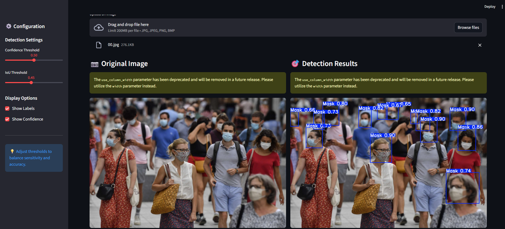

# 😷 AI Face Mask Detection System

An End-to-end face mask detection system powered by YOLOv8 and Streamlit. This application detects whether people in an image/video are wearing face masks and provides detailed analytics and compliance reports.


## ✨ Features

- 🎯 **Real-time Detection**: Accurate face mask detection using YOLOv8
- 📽️ **Video Processing**: upload with frame-by-frame detection
- 📊 **Analytics Dashboard**: Comprehensive statistics and compliance metrics
- 🎨 **Interactive UI**: Beautiful and intuitive Streamlit interface
- 📥 **Export Options**: Download JSON reports and annotated images
- ⚙️ **Customizable Settings**: Adjustable confidence and IoU thresholds
- 📈 **Compliance Tracking**: Automatic calculation of mask compliance rates

## 🚀 Demo



## 📋 Prerequisites

- Python 3.8 or higher
- pip package manager
- (Optional) CUDA-capable GPU for faster inference

## 🔧 Installation

### 1. Clone the repository

```bash
git clone https://github.com/mofayez22/face-mask-detection.git
cd face-mask-detection
```

### 2. Create virtual environment

```bash
# Windows
python -m venv venv
venv\Scripts\activate

# macOS/Linux
python3 -m venv venv
source venv/bin/activate
```

### 3. Install dependencies

```bash
pip install -r requirements.txt
```

### 4. Add your trained model

Place your trained YOLOv8 model file (`best.pt`) in the `model/` directory:

```
model/
└── best.pt
```

## 🎮 Usage

### Running the Application

```bash
streamlit run app.py
```

The application will open in your default browser at `http://localhost:8501`

### Basic Workflow

1. **Upload Image**: Click "Browse files" and select an image
2. **Adjust Settings**: Use sidebar sliders to configure detection thresholds
3. **View Results**: See detection results with statistics
4. **Export Data**: Download JSON reports or annotated images

### Configuration Options

- **Confidence Threshold** (0.0-1.0): Minimum confidence for detections (default: 0.5)
- **IoU Threshold** (0.0-1.0): Overlap threshold for non-maximum suppression (default: 0.45)
- **Display Options**: Toggle labels and confidence scores

## 📁 Project Structure

```
face-mask-detection/
├── app.py                 # Main Streamlit application
├── inference.py          # Model inference logic
├── requirements.txt      # Python dependencies
├── README.md            # Project documentation
├── .gitignore           # Git ignore rules
├── model/               # Model directory
│   └── best.pt         # Trained YOLOv8 model
└── assets/             # Project assets
    └── demo/           # Demo images and screenshots
```

## 🧪 Model Training

This project uses a YOLOv8 model trained on face mask datasets. To train your own model:

1. Prepare your dataset in YOLO format
2. Install Ultralytics: `pip install ultralytics`
3. Train the model:

```python
from ultralytics import YOLO

model = YOLO('yolov8n.pt')  # Start with pretrained model
results = model.train(
    data='your_dataset.yaml',
    epochs=100,
    imgsz=640,
    batch=16
)
```

4. Place the trained `best.pt` in the `model/` directory

## 📊 Detection Classes

The model detects two classes:
- **With Mask**: Person wearing a face mask correctly
- **Without Mask**: Person not wearing a face mask

## 🎯 Performance

- **Confidence Threshold**: Recommended 0.5 for balanced precision/recall
- **IoU Threshold**: Recommended 0.45 for optimal overlap filtering
- **Compliance Levels**:
  - High: ≥80% (Excellent)
  - Moderate: 50-79% (Acceptable)
  - Low: <50% (Needs attention)

## 🐛 Troubleshooting

### Model not found error
- Ensure `best.pt` is placed in the `model/` directory
- Check file path in `inference.py` (line 8)

### Import errors
- Verify all dependencies are installed: `pip install -r requirements.txt`
- Try reinstalling PyTorch: `pip install torch torchvision --force-reinstall`

### Slow inference
- Consider using GPU acceleration
- Install CUDA-enabled PyTorch version
- Reduce image size before inference

## 🤝 Contributing

Contributions are welcome! Please follow these steps:

1. Fork the repository
2. Create a feature branch (`git checkout -b feature/AmazingFeature`)
3. Commit your changes (`git commit -m 'Add some AmazingFeature'`)
4. Push to the branch (`git push origin feature/AmazingFeature`)
5. Open a Pull Request


## 👥 Authors

- **Muhamamd Fayez** - *Initial work* - [GitHub](https://github.com/mofayez22)

## 🙏 Acknowledgments

- [Ultralytics YOLOv8](https://github.com/ultralytics/ultralytics) for the detection framework
- [Streamlit](https://streamlit.io/) for the web framework
- Face mask dataset providers

## 📧 Contact

Project Link: [https://github.com/mofayez22/face-mask-detection](https://github.com/mofayez22/face-mask-detection)

## 🔮 Future Enhancements

- [ ] Real-time webcam detection
- [ ] Video file processing
- [ ] Batch processing for multiple images
- [ ] Model performance metrics dashboard
- [ ] Docker containerization
- [ ] REST API endpoint
- [ ] Mobile app integration

---

⭐ Star this repository if you find it helpful!
